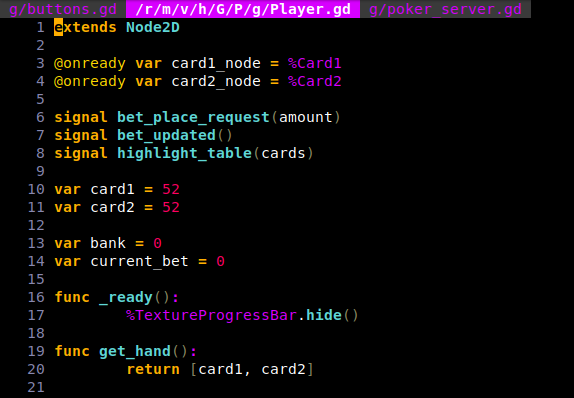

# godot-vim

Godot plugin to open godot scripts in single vim window. 

Linux-only.

## Installation
- Copy addons/godot-vim folder to your project's addon folder. 
OR
- [TODO] Download from asset store
#
- Enable plugin

## Deinstallation
- Disable plugin (Configuration will be restored)

